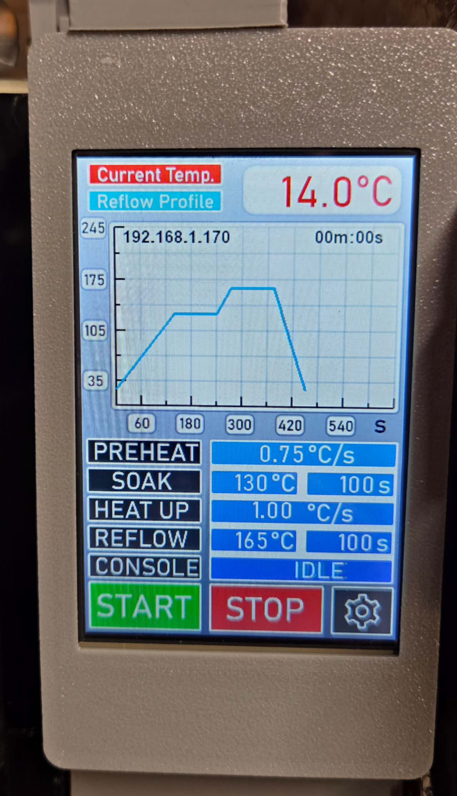
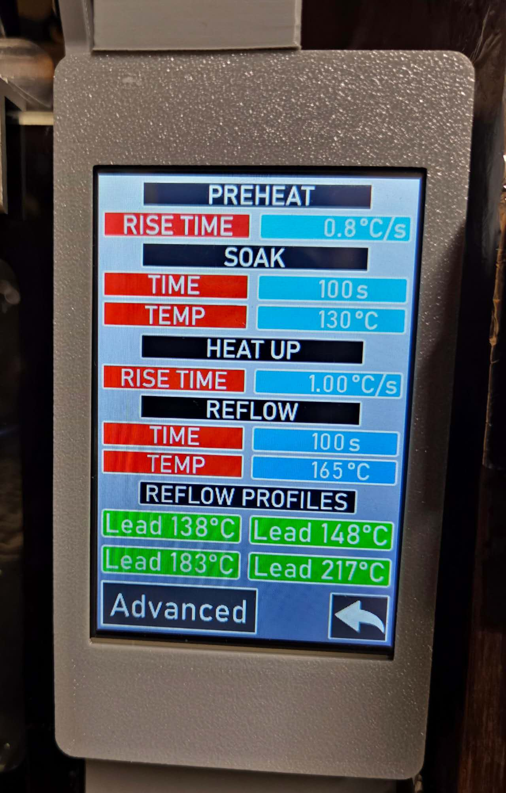
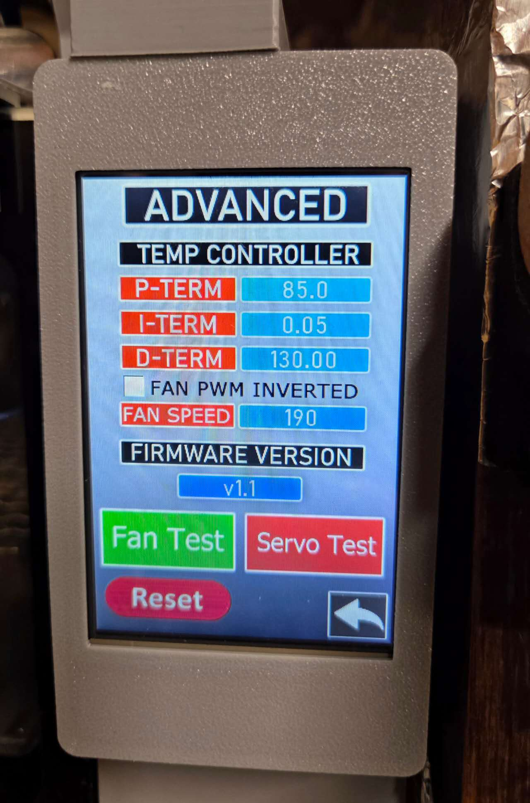
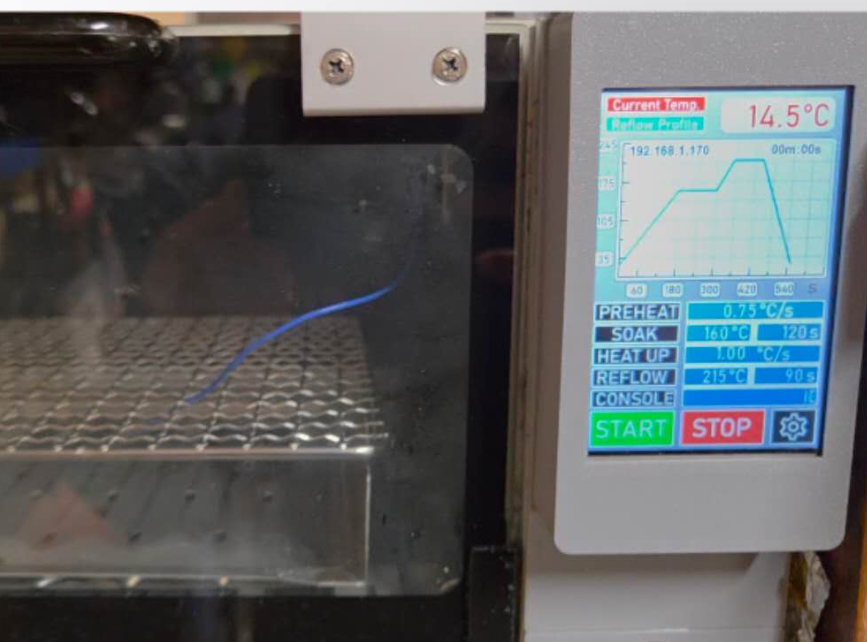
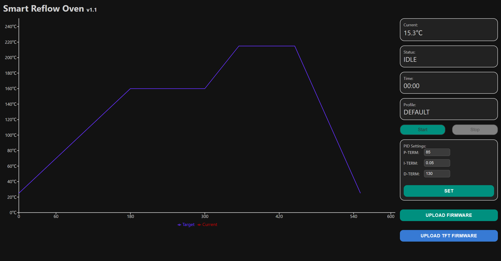
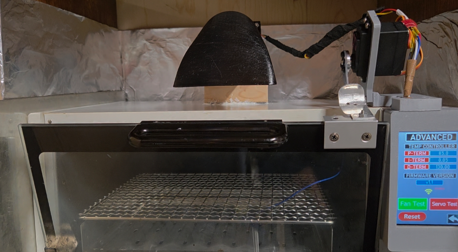

# 🔥 Smart Reflow Oven Controller
# 🔥 智能回流焊控制器

A feature-rich **ESP32-based reflow oven controller** with **Nextion HMI**, **web interface**, and **full reflow profile management**.  
基于 **ESP32** 的智能回流焊炉控制系统，集成 **Nextion （陶晶驰）触摸屏**、**Web 控制界面**，并提供完整、可配置的回流焊温度曲线管理功能。  

⚠️ **Note:** This project converts a **household small oven** into a smart reflow oven.  
⚠️ **说明**：本项目将家用小型烤箱改装为智能回流焊炉。

---

## ✨ Features | 功能亮点

- **PID Temperature Control** | 精准 PID 控制  
- **Single SSR with PWM Control** | 单路 PWM 控制固态继电器  
- **Nextion Touch Display & Web Dashboard** | 触摸屏 + Web 控制  
- **Custom & Predefined Profiles** | 可自定义及预置曲线  
- **Cooling Fan & Servo Door** | 风扇与舵机烤箱门控制  
- **OTA Firmware Update** | 支持远程升级  
- OTA **Nextion HMI** Firmware | 触摸屏固件升级
- 

---

## 🔥 Reflow Profiles | 回流焊曲线

### Pre-configured Profiles | 预置曲线（4 种）

- **Lead 138°C** – Ultra-low temperature solder paste  
  含铅 138°C（超低温焊锡膏）

- **Lead 148°C** – Low temperature solder paste  
  含铅 148°C（低温焊锡膏）

- **Lead 183°C** – Standard lead solder paste  
  含铅 183°C（标准焊锡）

- **Lead-Free 217°C** – High temperature lead-free solder paste  
  无铅 217°C（高温无铅焊锡）
  
- 

### Customizable Parameters | 可自定义参数

- First heat-up rate (0.2–1.5 °C/s) | 一次升温速率  
- Soak temperature & duration | 恒温温度与持续时间  
- Second heat-up rate | 二次升温速率  
- Reflow temperature & duration | 回流峰值温度与保持时间  

**Profile Management**  
Profiles can be saved, loaded, and modified via display or web interface  
**曲线管理**：支持通过屏幕或 Web 保存、加载和修改曲线

---

## 🌐 Network Features | 网络功能

- **WiFi Station Mode** | WiFi STA 模式：支持 DHCP 或静态 IP  
- **AP Configuration Portal** | AP 配网模式：首次启动自动进入配置页面  
- **OTA Updates** | 支持 HTTP 远程升级  
- **RESTful API** | 提供 HTTP 接口便于系统集成

---

## 🛡️ Safety Features | 安全特性

- **Temperature Monitoring** | 实时温度监测与异常校验  
- **Watchdog Timer** | ESP32 任务看门狗（30 秒）  
- **Automatic Shutdown** | 传感器异常立即停止加热  
- **Rate-of-Change Limiting** | 温升速率限制防止跳变

---

## 🧩 Hardware Requirements | 硬件需求

- ESP32 DevKit  
- Nextion Enhanced 3.5" display  
- MAX6675 K-type thermocouple module  
- 1 × Solid State Relay (SSR)  
- SG90 servo motor (or compatible)  
- DC cooling fan (12V recommended)  
- Buzzer (active or passive)

---

## 📚 Credits & Origin | 来源与致谢

Part of the code is **ported from** [DIY Reflow Oven (STM32)](https://www.instructables.com/DIY-REFLOW-OVEN/).  
The original project was based on **STM32**, and in this version it has been **ported to ESP32** with **WiFi connectivity** and additional features.  

Special thanks to **侃单** for contributing to the **hardware design**.  
特别感谢 **侃单** 对 **硬件设计** 的参与与贡献。  

部分代码移植自 [DIY Reflow Oven (STM32)](https://www.instructables.com/DIY-REFLOW-OVEN/)。  
原项目基于 **STM32**，本项目移植到 **ESP32**，并增加了 **WiFi 功能** 及其他改进。  
特别感谢 **侃单** 对 **硬件设计** 的参与与贡献。

